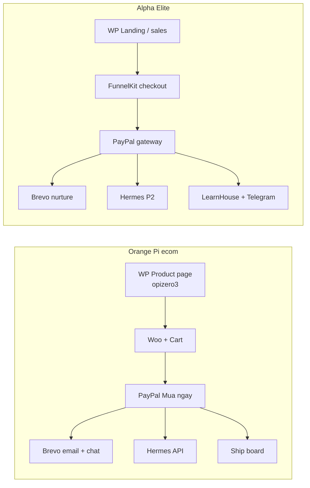
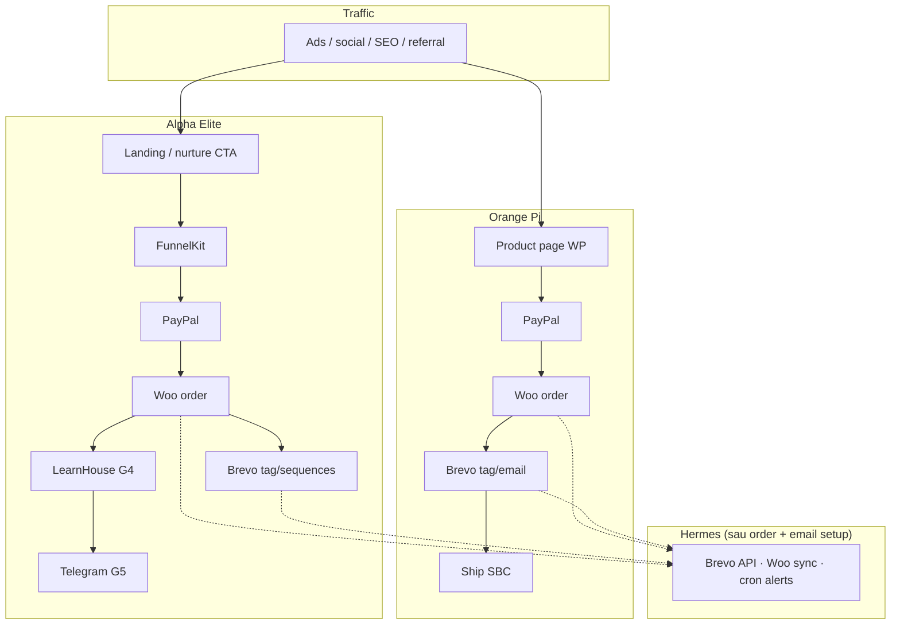
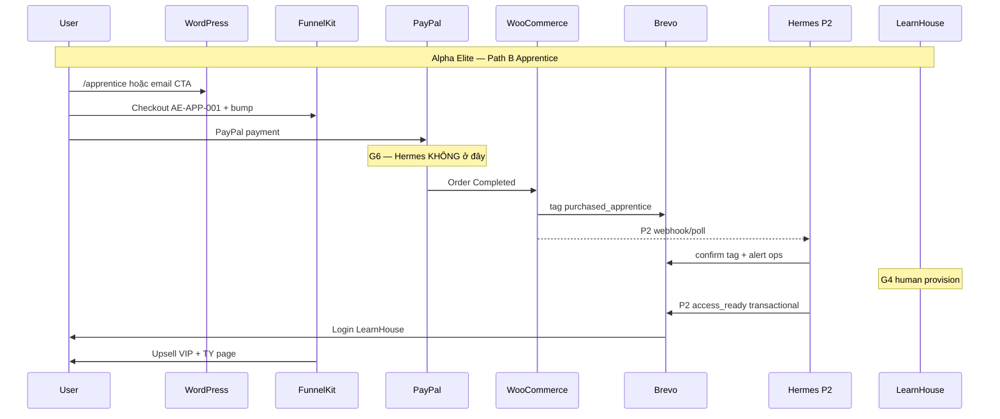
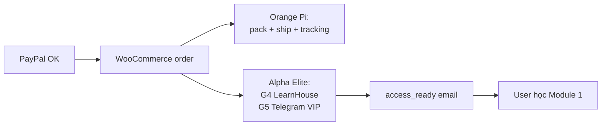
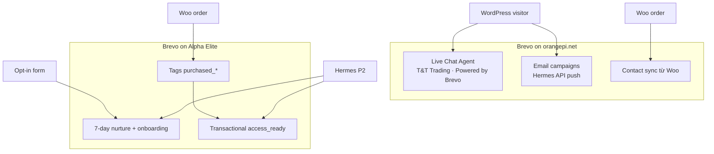
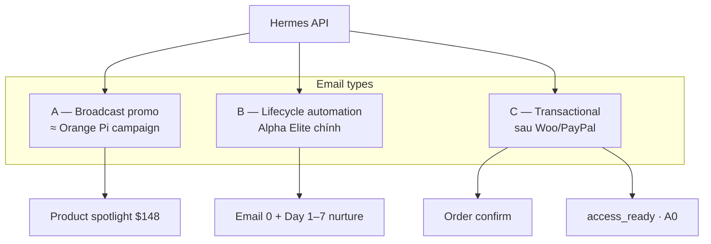
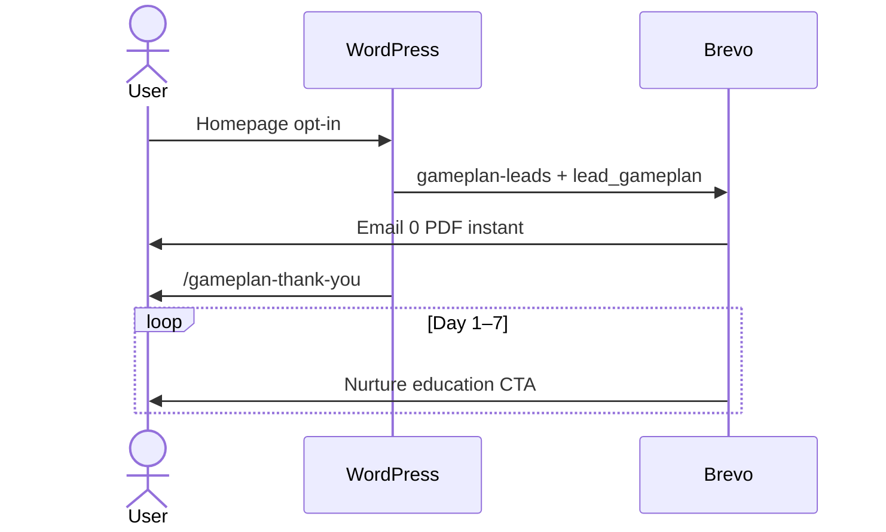
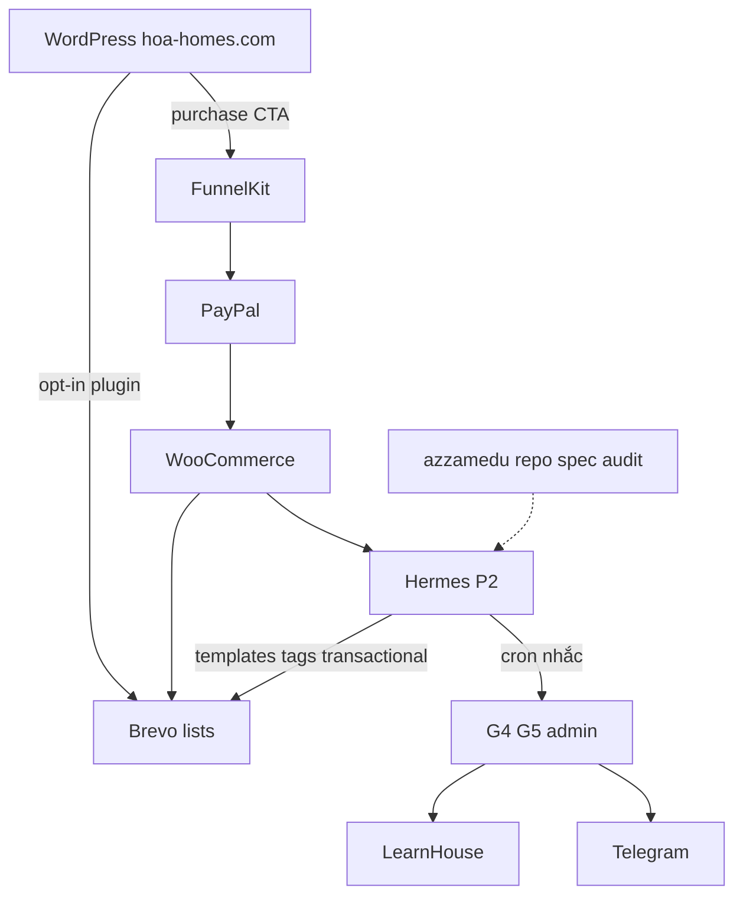
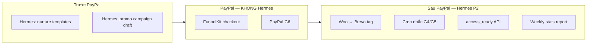
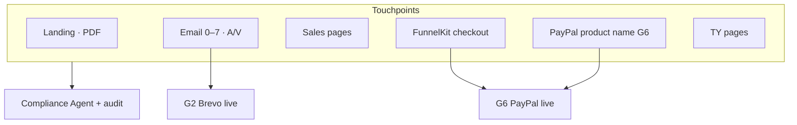

# Case Study Map — Hermes + Brevo API + PayPal Stack → Alpha Elite

> **Source:** Hermes agent session (Orange Pi / orangepi.net) — Brevo email campaign in <10 min vs ~1 week with a dedicated email marketer (10 years ago).
>
> **Stack reference (Wappalyzer orangepi.net):** WordPress · WooCommerce 9.3.1 · PayPal · Brevo (email + live chat) · Hermes WebUI.
>
> **Insight:** *"Cứ có API là đời bớt khổ"* — any marketing SaaS with a public API can be orchestrated by an AI agent.
>
> **Sơ đồ:** vẽ trực tiếp trong file này (khối mermaid) — **Cursor/GitHub Preview** `Ctrl+Shift+V` để thấy hình. Backup HTML: [alpha-elite-ux-flow-diagrams.html](alpha-elite-ux-flow-diagrams.html)

**Full UX flows (Hermes P2):** [alpha-elite-ux-flow-hermes-p2.md](../plans/alpha-elite-ux-flow-hermes-p2.md)

---

## What the case study proves

| Before (TMĐT ~10 năm trước) | After (Hermes + Brevo API) |
|-----------------------------|----------------------------|
| 1 nhân viên chuyên email/tuần | Agent + API, <10 phút/campaign |
| Lọc list thủ công | API: segments, contacts, attributes |
| Soạn HTML template, duyệt, chèn ảnh | Agent generates HTML → API upload template |
| Lên lịch gửi + báo cáo thủ công | API: create campaign, schedule, stats |

**Hermes workflow (screenshot reference):**
1. User describes campaign goal in chat
2. Agent drafts/updates HTML email template (live preview)
3. Agent offers: *"Upload to Brevo as template + create campaign?"*
4. One confirmation → API push → ready to send

---

## Full stack map — Orange Pi ecom → Alpha Elite

### Stack song song

```text
ORANGE PI (orangepi.net)              ALPHA ELITE (hoa-homes.com)
────────────────────────              ────────────────────────────

WordPress                             WordPress + Elementor
WooCommerce 9.x                       WooCommerce + FunnelKit
PayPal "Mua ngay" / Add to cart       PayPal qua FunnelKit checkout
Brevo — email marketing (Hermes)      Brevo — nurture + onboarding (Hermes)
Brevo — Live Chat "Chat Agent"        (chưa MVP; có thể Phase 3)
Hermes — campaign API                 Hermes — template + tag + transactional
Fulfillment: ship SBC                 Fulfillment: LearnHouse + Telegram VIP
```



| Layer | Orange Pi | Alpha Elite | Hermes chạm? |
|-------|-----------|-------------|--------------|
| Front door | WP product pages | Elementor funnel pages | Không (G1 human) |
| Checkout | Cart / PayPal on product | FunnelKit bump/upsell/TY | Không |
| Payment | PayPal via Woo | PayPal via Woo (**G6**) | Không |
| Email | Brevo campaigns + chat | Brevo lifecycle + onboarding | **Có — API P2** |
| Fulfillment | Ship hardware | Digital: LMS + VIP TG | Nhắc G4/G5 (P2) |

**Một câu:** Cùng khung WP + Woo + PayPal + Brevo; khác **sau PayPal** (ship vs LearnHouse) và **loại email** (promo vs education nurture).

---

## Flow tổng — PayPal nằm giữa checkout và fulfillment



---

## PayPal — map chi tiết

### Orange Pi (product page)

| Bước | Hệ thống | Việc xảy ra |
|------|----------|-------------|
| 1 | Trang sản phẩm Woo | SKU `opizero3`, chọn RAM, ADD TO CART hoặc **PayPal Mua ngay** |
| 2 | PayPal | Thanh toán express / checkout |
| 3 | WooCommerce | Order `Completed` — source of truth |
| 4 | Brevo | Tag khách, email confirm / marketing |
| 5 | Ops | Đóng gói, ship |

### Alpha Elite (funnel checkout)

| Bước | Hệ thống | Việc xảy ra |
|------|----------|-------------|
| 1 | `/apprentice` hoặc email CTA | Đọc offer AE-APP-001 ($297) |
| 2 | FunnelKit | Checkout + optional bump + upsell VIP |
| 3 | PayPal | WooCommerce gateway (**G6** live) |
| 4 | WooCommerce | Order `Completed` |
| 5 | Brevo | Tag `purchased_apprentice`, stop nurture |
| 6 | Admin G4 | LearnHouse user + enroll ≤24h |
| 7 | Brevo | `access_ready` email |
| 8 | FunnelKit | TY `/thank-you/apprentice` |



### Bảng map PayPal 1:1

| Khía cạnh | Orange Pi | Alpha Elite |
|-----------|-----------|-------------|
| Vị trí nút PayPal | Trên product page | Trên FunnelKit checkout |
| Sản phẩm | Board + variant RAM | Course / subscription SKU |
| Sau PayPal | Ship | LearnHouse + Telegram |
| Email sau mua | Order confirm | `access_ready` + A1–A4 |
| Compliance | Shop policy | Risk disclaimer checkout + email |
| Crypto | (nếu có) | Manual MVP — song song PayPal |

```text
User intent  →  Checkout surface  →  PAYPAL  →  Woo order truth  →  Fulfillment
                Orange Pi: product page          ship board
                Alpha Elite: FunnelKit           LearnHouse + Telegram
                              ↑
                    Hermes KHÔNG thay bước này
```

---

## Fulfillment digital vs ship hàng



| Sau PayPal | Orange Pi | Alpha Elite |
|------------|-----------|-------------|
| Hệ thống ops | Kho vận | Admin G4 + G5 |
| User nhận | Board tại nhà | Email login LMS |
| SLA | Shipping days | **≤24h** access |
| Hermes P2 | (thường ngoài scope) | Cron nhắc G4 nếu quá hạn |

**Pain UX chung:** Đã trả tiền mà chưa nhận value → refund. Ecom = chậm ship; Alpha Elite = chậm provision.

---

## Brevo — hai vai trò trên Orange Pi



| Brevo | Orange Pi (live) | Alpha Elite MVP | Alpha Elite + Hermes P2 |
|-------|------------------|-----------------|-------------------------|
| Live chat pre-sale | Có (screenshot) | Chưa | Optional Phase 3 |
| Email campaign | Hermes push | Human setup UI | Hermes API upload |
| Woo → contact/tag | Plugin | Plugin / manual | Hermes Woo REST |

---

## Ba kiểu email — map ecom → education



| Kiểu | Orange Pi | Alpha Elite | Hermes |
|------|-----------|-------------|--------|
| **A Broadcast** | Weekly product promo | Launch Apprentice / VIP promo | Chat → template → campaign |
| **B Lifecycle** | Newsletter series (ít) | Gameplan nurture 7 ngày | Upload 7 templates + automation |
| **C Transactional** | Order confirm | `access_ready`, V0 | API send sau G4/G5 |

---

## Journey map — song song ecom vs funnel

```mermaid
flowchart LR
    subgraph OP_J["Orange Pi journey"]
        O1[Product page] --> O2[PayPal / cart]
        O2 --> O3[Order OK]
        O3 --> O4[Brevo email]
        O3 --> O5[Ship]
    end

    subgraph AE_J["Alpha Elite journey"]
        A1[Homepage opt-in] --> A2[Email 0–7]
        A2 --> A3[/apprentice]
        A3 --> A4[FunnelKit + PayPal]
        A4 --> A5[TY + upsell]
        A5 --> A6[access_ready]
        A6 --> A7[LearnHouse]
        A5 --> A8[VIP Telegram]
    end
```

| Giai đoạn | Orange Pi | Alpha Elite |
|-----------|-----------|-------------|
| Thu lead | Newsletter / browse | Gameplan opt-in |
| Nuôi | Product emails | Day 1–7 education |
| Convert | PayPal on product | PayPal on FunnelKit |
| Deliver | Ship | LMS + community |
| Upsell | Accessories | VIP / Quant / DWY |

---

## Path Alpha Elite — full flows

### Path A — Lead only



*Hermes P2 setup (trước traffic):* upload templates Email 0–7 qua API sau Compliance PASS + G2.

### Path B — Apprentice + PayPal

```mermaid
flowchart TD
    N[Nurture Day 5–7 CTA] --> AP[/apprentice]
    AP --> FK[FunnelKit AE-APP-001]
    FK --> PP[PayPal G6]
    PP --> WC[Woo Completed]
    WC --> TAG[purchased_apprentice]
    TAG --> STOP[Stop Sequence 1]
    WC --> HM[Hermes P2 alert G4]
    G4[G4 LearnHouse enroll] --> AR[access_ready]
    AR --> A14[Onboarding A1–A4]
    FK --> UP[VIP upsell]
    FK --> TY[/thank-you/apprentice]
```

### Path C — VIP + Telegram

```mermaid
flowchart TD
    START[Upsell hoặc /vip] --> FK2[FunnelKit VIP SKU]
    FK2 --> PP2[PayPal]
    PP2 --> WC2[Woo OK]
    WC2 --> TAG2[purchased_vip]
    WC2 --> HM2[Hermes tag sync]
    TAG2 --> TY2[/thank-you/vip]
    TY2 --> FORM[@telegram form]
    FORM --> G5[G5 add VIP group]
    G5 --> VSEQ[V0–V3 emails]
    G5 --> LH2[VIP LearnHouse library]
    G5 --> TG2[Telegram room]
```

### Path D — Ascension (post-MVP)

```text
VIP 30d+ → Quant checkout AE-QNT-001 → PayPal → LearnHouse desk
         → DWY bump AE-DWY-001 → calendar ops
         → Inner Circle AE-IC-APP → manual G0 invite
```

---

## WordPress + Brevo + Hermes — ai làm gì



| Thành phần | Làm gì | Hermes? |
|------------|--------|---------|
| WordPress | Capture lead, sales pages | Không |
| FunnelKit + PayPal | Thu tiền | Không |
| Brevo plugin | Opt-in → list | Không (real-time) |
| Brevo + Hermes P2 | Email ops | **Có** |
| LearnHouse / Telegram | Fulfillment digital | Nhắc ops only |

---

## Hermes chạm PayPal flow ở đâu



| Giai đoạn | Orange Pi + Hermes | Alpha Elite + Hermes |
|-----------|-------------------|----------------------|
| Trước PayPal | Campaign → product | Nurture → /apprentice |
| PayPal | Plugin — không Hermes | G3 + G6 — không Hermes |
| Ngay sau order | Tag Brevo | `purchased_apprentice` |
| Fulfillment | Ship — ngoài Hermes | G4 LMS — Hermes nhắc |
| Báo cáo | Campaign revenue | Nurture → conversion |

---

## Compliance — PayPal + email (Alpha Elite ≠ ecom)



| Orange Pi PayPal | Alpha Elite PayPal |
|------------------|-------------------|
| Tên sản phẩm hardware | SKU education — no prohibited terms |
| Mô tả specs | Course + risk disclaimer |
| Receipt = ship order | Receipt = course — access ≤24h |

---

## Map to Alpha Elite (`azzamedu` repo)

### Same pattern, different product

| Orange Pi (case study) | Alpha Elite (this project) |
|------------------------|----------------------------|
| Product: SBC hardware | Product: Trading education (Gameplan → Apprentice → VIP) |
| Site: orangepi.net (WooCommerce intl) | Site: hoa-homes.com (WP + WooCommerce) |
| PayPal: product page | PayPal: FunnelKit checkout |
| Email: Brevo campaigns (promo, product) | Email: Brevo nurture + onboarding + `access_ready` |
| Brevo chat: pre-sale | Not MVP |
| Agent: Hermes | Hermes P2 + Cursor `.ai/agents/` |
| API: Brevo + Woo REST | **Same APIs** — different lists/tags |

### Where it already lives in the repo

```text
TRAFFIC → WordPress/Elementor (hoa-homes.com)
              │
    ┌─────────┴─────────┐
    ▼                   ▼
  Brevo                 WooCommerce + FunnelKit
  · gameplan-leads      · AE-APP-001, AE-VIP-*
  · 7-day nurture       · PayPal gateway (G6)
  · access_ready        · order webhooks (Phase 2)
    │                         │
    ▼                         ▼
  Hermes P2 (API)         LearnHouse + Telegram
```

| Repo artifact | Role today | Hermes-style API upgrade |
|---------------|------------|-------------------------|
| `docs/brevo_email_sequence.md` | Spec: lists, tags, Email 0–7, onboarding | Agent reads spec → pushes templates via API |
| `.ai/agents/brevo-email-agent.md` | Drafts copy + compliance; **human enables send (G2)** | Extend: call Brevo API after compliance pass |
| `docs/funnelkit_checkout_map.md` | Checkout + PayPal wiring | Unchanged — Hermes post-order only |
| `sales/assets/brevo/` | Template drafts (planned) | HTML → `POST /v3/smtp/templates` |
| `web/wordpress/elementor-spec-homepage-hero-optin.md` | Form → Brevo list `gameplan-leads` | Unchanged (capture) |

### MVP vs Phase 2

| Flow | MVP (current) | Phase 2 (Hermes pattern) |
|------|---------------|---------------------------|
| Gameplan opt-in | WP form → Brevo plugin → list | Same |
| PayPal checkout | FunnelKit + Woo G6 | Same — Hermes không đụng |
| Email 0 + nurture | Human builds automation in Brevo UI | Agent creates templates + workflow via API |
| Woo → Brevo tag | Plugin / manual | Hermes Woo webhook + Brevo API |
| Post-purchase `access_ready` | Admin sends manually after G4 | Hermes transactional API after G4 |
| Campaign (promo, launch) | Manual in Brevo | Agent: segment + template + schedule in chat |
| Reporting | Brevo dashboard | Agent pulls stats API → summary in chat |

---

## Brevo API surface (relevant endpoints)

Reference: [Brevo API docs](https://developers.brevo.com/)

| Task | API | Agent action |
|------|-----|--------------|
| Upload HTML template | `POST /v3/smtp/templates` | After compliance review |
| Create campaign | `POST /v3/emailCampaigns` | User confirms in chat |
| Manage contacts | `POST /v3/contacts` | Woo webhook / form sync |
| Lists & segments | `GET/POST /v3/contacts/lists` | Tag `purchased_apprentice`, etc. |
| Send transactional | `POST /v3/smtp/email` | `access_ready` automation |
| Stats | `GET /v3/emailCampaigns/{id}` | Weekly agent report |

**Principle:** Agent never sends to production lists without **G2 human gate** (see `docs/human-approval-gates.md`).

---

## Agent loop (Alpha Elite version of Hermes)

```text
User: "Tạo email Day 3 nurture + push lên Brevo"
        │
        ▼
Brevo Email Agent (.ai/agents/brevo-email-agent.md)
  · Read docs/brevo_email_sequence.md (Day 3 spec)
  · Draft subject + body
  · Compliance Agent review (mandatory)
        │
        ▼
Human: approve copy (G2)
        │
        ▼
Hermes P2 (Brevo API)
  · POST template
  · Attach to automation or create campaign draft
        │
        ▼
Human: enable send / schedule in Brevo (or explicit "go live")
```

---

## Other SaaS — same "có API là đời bớt khổ" map

| SaaS | Alpha Elite use | API potential |
|------|-----------------|---------------|
| **Brevo** | Email nurture, onboarding | ✅ Priority — this case study |
| **WooCommerce** | Orders, SKUs, PayPal orders | REST API + webhooks → auto tags |
| **PayPal** | Payment gateway via Woo | Woo is source of truth — not direct Hermes |
| **LearnHouse** | LMS delivery | Phase 2: auto-enroll on order |
| **Telegram Bot API** | VIP onboarding | Already API-first (`telegram-bot/`) |
| **GA4** | Conversion events | Reporting API (later) |
| Google/Meta/TikTok Ads | Not in MVP backlog | Full campaign API — **Later** |

---

## SKU → PayPal → Fulfillment matrix

| Offer | SKU | PayPal qua | Fulfillment | Email |
|-------|-----|------------|-------------|-------|
| Gameplan | AE-GP-000 | — | PDF | Email 0 + Day 1–7 |
| Apprentice | AE-APP-001 | FunnelKit | LearnHouse G4 | A0–A4 |
| VIP | AE-VIP-MON/YR | FunnelKit | Telegram G5 + LH | V0–V3 |
| Quant | AE-QNT-001 | FunnelKit | LH desk | Custom |
| DWY | AE-DWY-001 | Bump | Calendar | — |

---

## Backlog items (from this case study)

| ID | Task | Priority |
|----|------|----------|
| B-A01 | Brevo API key in env (never commit) | P1 |
| B-A02 | Script/skill: `upload-brevo-template.py` (HTML → API) | P1 |
| B-A03 | Extend Brevo Email Agent: draft → API draft template | P2 |
| B-A04 | WooCommerce webhook → Brevo tag sync (replace manual) | P2 |
| B-A05 | `access_ready` via Brevo transactional API | P2 |
| B-A06 | Hermes profile `alpha-elite` isolated from Orange Pi | P1 |

---

## Compliance note (Alpha Elite ≠ Orange Pi)

Orange Pi emails = product promos. Alpha Elite emails = **education only** — every template must pass Compliance Agent:

- No profit guarantees in subject/body
- Footer disclaimer required
- No "signal group" positioning
- PayPal product name / checkout copy reviewed before **G6**

See `docs/compliance_guardrails.md` before any API push.

---

## Related repo paths

| Doc | Purpose |
|-----|---------|
| [alpha-elite-ux-flow-hermes-p2.md](../plans/alpha-elite-ux-flow-hermes-p2.md) | Full UX + Hermes P2 (gates, SLA, failure modes) |
| `docs/brevo_email_sequence.md` | Sequence truth |
| `docs/mvp-system-map.md` | Path A/B/C data flows |
| `docs/funnelkit_checkout_map.md` | PayPal + FunnelKit wiring |
| `.ai/agents/brevo-email-agent.md` | Agent contract |
| `docs/human-approval-gates.md` | G2 G4 G5 G6 |

---

*Mapped: 2026-07-06 · Pattern source: Hermes × Brevo × PayPal × orangepi.net → Alpha Elite*
