# Alpha Elite — UX Flow + Hermes Phase 2

> **Reference plan** · Toàn funnel (Awareness → Ascension) · PayPal · fulfillment digital · compliance · Hermes P2.
>
> **Mapped from:** Orange Pi (WP + Woo + PayPal + Brevo + Hermes) → Alpha Elite.

---

## Cách xem sơ đồ (quan trọng)

File này **đã có sơ đồ vẽ** — dùng khối `mermaid`. Khi mở **Preview** sẽ thấy **hình**, không phải code:

| Cách xem | Thao tác |
|----------|----------|
| **Cursor / VS Code** | Mở file này → `Ctrl+Shift+V` (Preview) hoặc biểu tượng kính lúp góc phải |
| **GitHub** | Push lên repo → GitHub tự render mermaid thành diagram |
| **Trình duyệt (không cần Preview)** | Double-click [alpha-elite-ux-flow-diagrams.html](alpha-elite-ux-flow-diagrams.html) — bản HTML cùng nội dung |

> Nếu chỉ nhìn tab **Editor** (raw markdown) → thấy code là bình thường. Chuyển sang **Preview** để thấy flowchart.

**Related:** [hermes-brevo-api-automation](../case-studies/hermes-brevo-api-automation.md) · [user-journey.md](../../docs/user-journey.md) · [mvp-system-map.md](../../docs/mvp-system-map.md)

---

## Tóm tắt một câu

**Alpha Elite = cùng stack Orange Pi (WP + Woo + PayPal + Brevo), thay ship hàng bằng LearnHouse + Telegram, thêm FunnelKit + compliance education. Hermes P2 ngồi sau PayPal và sau repo audit — không đụng nút PayPal của user.**

---

## 1. Orange Pi ecom ↔ Alpha Elite (so sánh)

```mermaid
flowchart LR
    subgraph OP["🟠 Orange Pi orangepi.net"]
        direction TB
        OP1[Product page opizero3]
        OP2[PayPal Mua ngay / Cart]
        OP3[Woo order]
        OP4[Brevo email + chat]
        OP5[Hermes campaign API]
        OP6[Ship board]
        OP1 --> OP2 --> OP3 --> OP4
        OP3 --> OP5
        OP3 --> OP6
    end

    subgraph AE["🔵 Alpha Elite hoa-homes.com"]
        direction TB
        AE1[Landing opt-in Gameplan]
        AE2[Brevo Email 0 + Day 1-7]
        AE3[/apprentice + FunnelKit]
        AE4[PayPal G6]
        AE5[Woo + Brevo tags]
        AE6[Hermes P2 sync + alert]
        AE7[LearnHouse + Telegram]
        AE1 --> AE2 --> AE3 --> AE4 --> AE5
        AE5 --> AE6 --> AE7
    end
```

| | Orange Pi | Alpha Elite |
|---|-----------|-------------|
| PayPal ở đâu | Trên product page | Trên FunnelKit checkout |
| Sau PayPal | Ship hardware | LearnHouse G4 + Telegram G5 |
| Brevo | Promo campaign + live chat | Nurture + onboarding |
| Hermes | Push product email | Template + tag + cron nhắc ops |
| Compliance | Shop policy | Education + risk disclaimer |

---

## 2. Sơ đồ một trang — Alpha Elite full stack

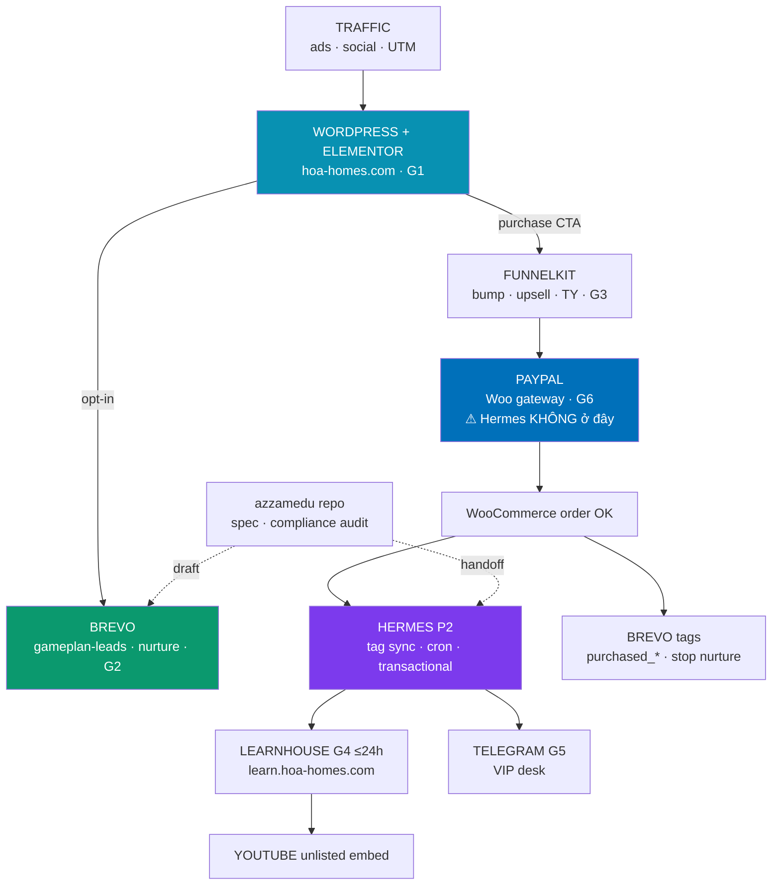

---

## 3. PayPal — vị trí trong flow

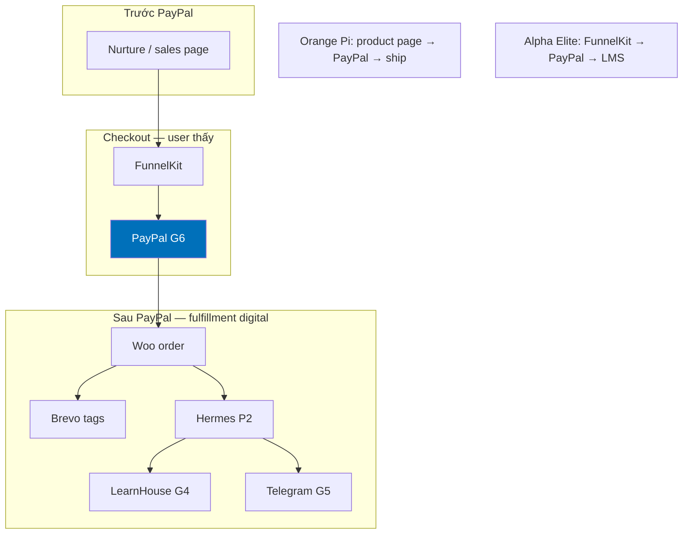

```text
User  →  FunnelKit checkout  →  PAYPAL  →  Woo order  →  LearnHouse + Telegram
                              ↑
                    Hermes KHÔNG thay bước này
```

| | Orange Pi | Alpha Elite |
|---|-----------|-------------|
| Nút PayPal | Product page "Mua ngay" | FunnelKit checkout |
| Sau PayPal | Ship + tracking | `access_ready` email ≤24h |
| Email sau mua | Order confirm | Sequence A0–A4 |

---

## 4. Fulfillment digital vs ship hàng

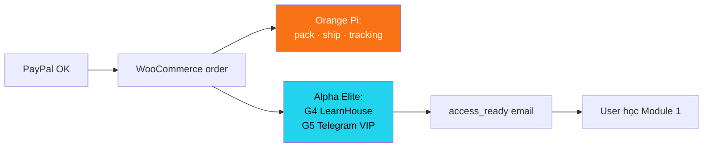

**Pain UX:** Đã trả PayPal mà chưa nhận value → refund. Ecom = chậm ship · Alpha Elite = chậm provision G4.

---

## 5. Bốn lớp hệ thống

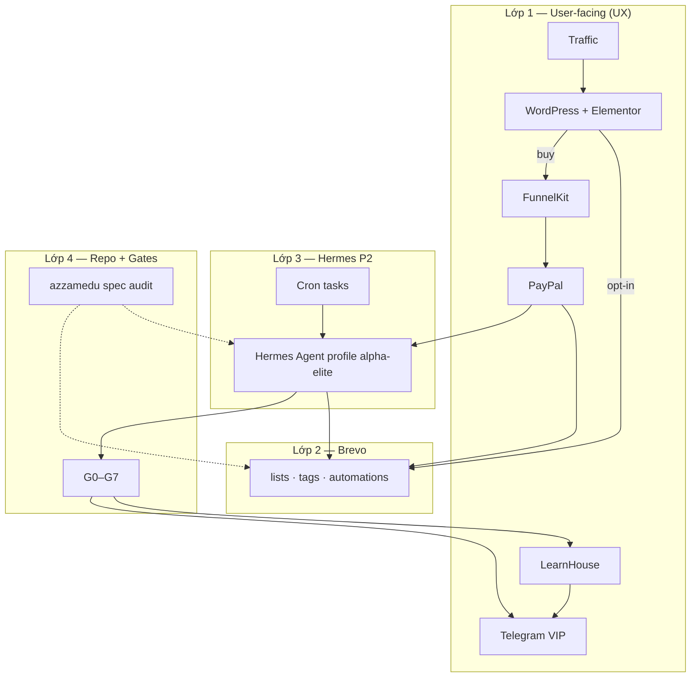

| Lớp | Vai trò | User thấy? |
|-----|---------|------------|
| L1 | Cửa · quầy · PayPal · LMS · TG | Có |
| L2 | Email lifecycle | Inbox |
| L3 | API ops + cron | Không |
| L4 | Compliance + human gates | Không |

---

## 6. User journey — 5 giai đoạn

```mermaid
flowchart LR
    subgraph S1["① AWARENESS"]
        A1[Ads / referral] --> A2[Homepage]
    end

    subgraph S2["② CONSIDERATION"]
        B1[Opt-in Gameplan] --> B2[Email 0-7]
    end

    subgraph S3["③ CONVERSION"]
        C1[/apprentice] --> C2[FunnelKit] --> C3[PayPal] --> C4[TY + upsell]
    end

    subgraph S4["④ RETENTION"]
        D1[access_ready] --> D2[LearnHouse] --> D3[Onboarding A1-A4]
    end

    subgraph S5["⑤ ASCENSION"]
        E1[Quant · DWY · Inner Circle]
    end

    S1 --> S2 --> S3 --> S4 --> S5
    C4 -->|VIP| D4[VIP Telegram]
    D3 --> E1
    D4 --> E1
```

| Stage | User nghĩ | Hệ thống trả lời |
|-------|-----------|------------------|
| ① | "Cần khung, không signal" | Hero disclaimer |
| ② | "Cho Gameplan trước" | Email 0 < 5 phút |
| ③ | "Có đáng học không?" | Sales + FAQ compliance |
| ④ | "Đã trả tiền — khi nào vào?" | SLA ≤24h |
| ⑤ | "Muốn desk sâu hơn" | VIP → Quant |

---

## 7. Path A — Lead only (opt-in → nurture)

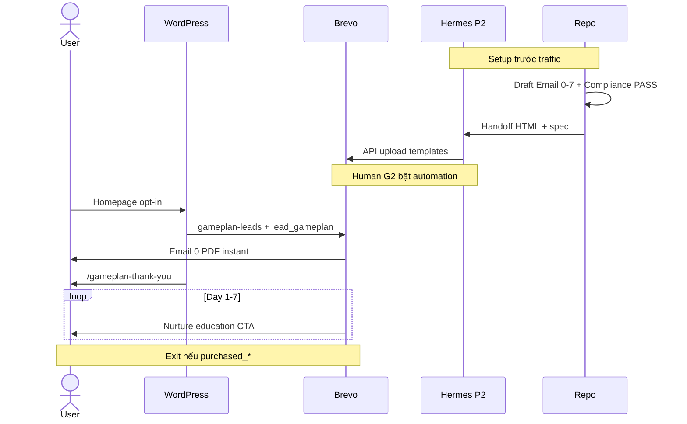

Capture: **WP form → Brevo plugin** (không qua Hermes real-time).

---

## 8. Path B — Apprentice + PayPal

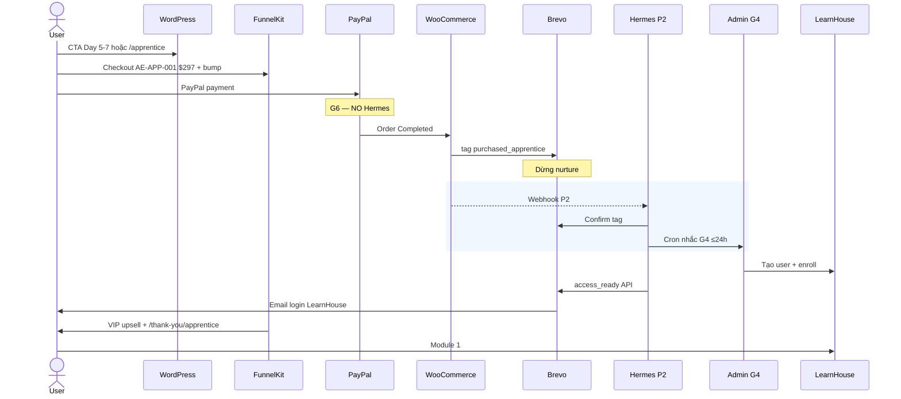

---

## 9. Path C — VIP + Telegram

```mermaid
flowchart TD
    START[Upsell hoặc /vip] --> FK[FunnelKit VIP SKU]
    FK --> PP[PayPal G3+G6]
    PP --> WC[Woo OK]
    WC --> TAG[purchased_vip · Sequence 3]
    WC --> HM[Hermes tag + alert G5]

    TAG --> TY[/thank-you/vip]
    TY --> FORM[@telegram username]
    FORM --> G5[Admin G5 add group]
    G5 --> V1[Brevo V0-V3]
    G5 --> LH[VIP LearnHouse library]
    G5 --> TG[Telegram VIP room]
    HM --> CRON[nhắc nếu >24h chưa add TG]
```

---

## 10. Path D — Ascension (post-MVP)

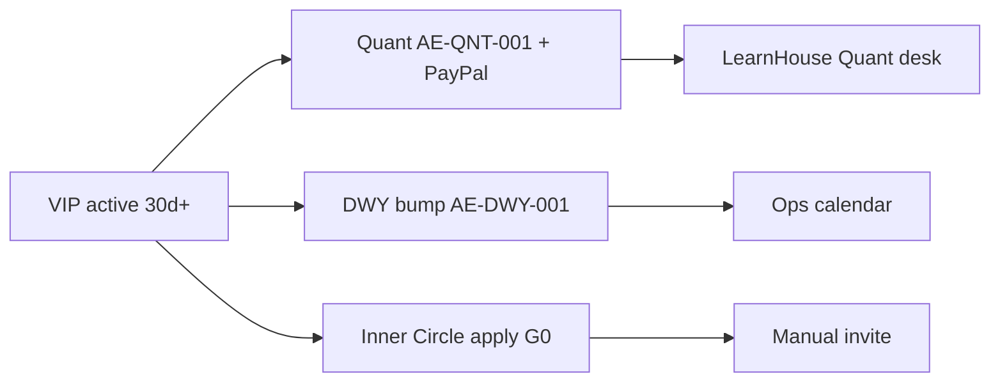

---

## 11. Hermes P2 — trước / trong / sau PayPal

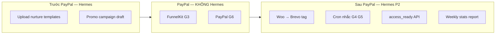

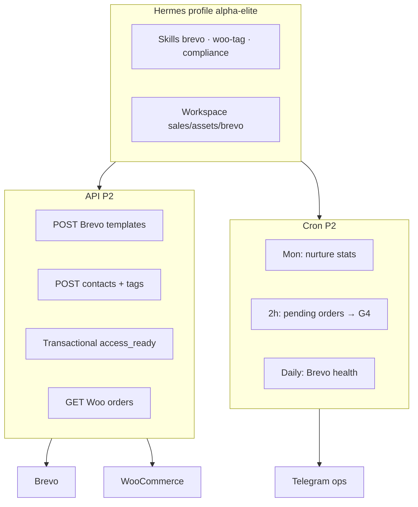

| Việc | MVP | Hermes P2 |
|------|-----|-----------|
| Setup 7 emails | Brevo UI tay | API upload |
| Woo → tag | Plugin/manual | Webhook + API |
| access_ready | Admin gửi | API sau G4 |
| Nhắc provision | Tay | Cron Telegram |

---

## 12. Compliance + Human gates

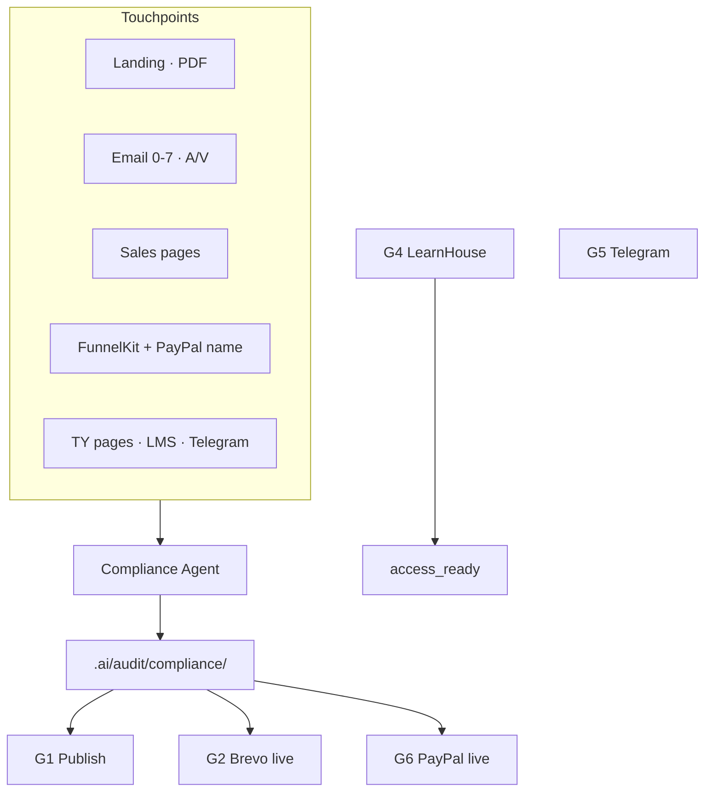

**Hermes P2 rules:** Chỉ push template có Compliance PASS · không G2 go-live · không override G4/G5.

---

## 13. Ma trận SKU → PayPal → Fulfillment

| Offer | SKU | PayPal | Fulfillment | Email |
|-------|-----|--------|-------------|-------|
| Gameplan | AE-GP-000 | — | PDF | Email 0 + Day 1–7 |
| Apprentice | AE-APP-001 | FunnelKit | LearnHouse G4 | A0–A4 |
| VIP | AE-VIP-MON/YR | FunnelKit | Telegram G5 + LH | V0–V3 |
| Quant | AE-QNT-001 | FunnelKit | LH desk | Custom |
| DWY | AE-DWY-001 | Bump | Calendar | — |
| Crypto | — | Manual | Same as Apprentice | Same tags |

---

## 14. SLA & failure modes

| Sự cố UX | Fix | Hermes P2 |
|----------|-----|-----------|
| Không Email 0 | Sửa G2 automation | Health cron |
| Nurture sau mua | Woo→tag | Webhook P2 |
| PayPal OK, 48h chưa LMS | G4 escalation | Cron 2h |
| VIP chưa vào TG | G5 + resend V0 | Alert ops |

| Event | SLA |
|-------|-----|
| Gameplan | Instant |
| Apprentice access | ≤ 24h G4 |
| VIP Telegram | ≤ 24h G5 |

---

## 15. MVP vs Hermes P2

| | MVP | Hermes P2 |
|---|-----|-----------|
| **User UX** | Baseline | **Giống hệt** |
| Setup email | Giờ tay | < 1h API |
| Tag sau PayPal | Manual | Tự động |
| Gates G2/G4/G5/G6 | Human | **Vẫn human** |

---

## 16. Telegram Mini App — BottomButton (Shop P1)

> **Nguồn:** [core.telegram.org/bots/webapps#bottombutton](https://core.telegram.org/bots/webapps#bottombutton)  
> **Chi tiết:** [telegram-bot/docs/mini-app-bottom-button.md](../../telegram-bot/docs/mini-app-bottom-button.md)

Thay vì mỗi offer là inline URL ra browser, **Mini App Shop** dùng nút native dưới cùng:

| Nút | Alpha Elite |
|-----|-------------|
| **MainButton** | `Pay $297` → `openLink` FunnelKit (PayPal G6 **không đổi**) |
| **SecondaryButton** | `« Danh mục` / `Cancel` |

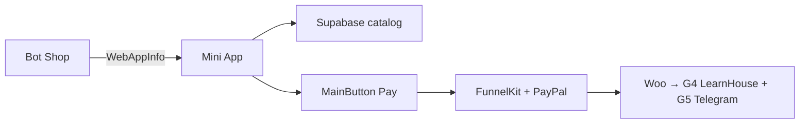

Catalog vẫn **Model B**: Woo sync → Supabase → Mini App render giá/SKU; BottomButton chỉ là lớp UX Telegram.

---

## Doc index

| Topic | File |
|-------|------|
| Case study + PayPal map | `knowledge/case-studies/hermes-brevo-api-automation.md` |
| HTML viewer (double-click) | `knowledge/plans/alpha-elite-ux-flow-diagrams.html` |
| Mini App BottomButton | `telegram-bot/docs/mini-app-bottom-button.md` |
| Shop catalog Model B | `telegram-bot/docs/shop-catalog.md` |
| Email spec | `docs/brevo_email_sequence.md` |
| Gates | `docs/human-approval-gates.md` |

---

*Updated: 2026-07-06 · Sơ đồ: mermaid trong file này (Preview) + HTML backup*
