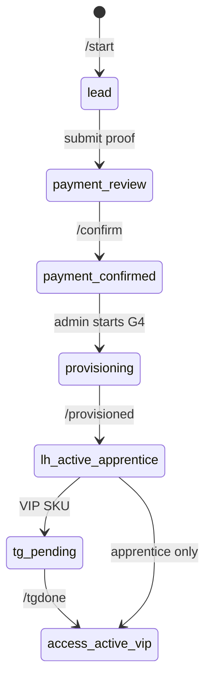

# Bot Flow — Commands & State Machine

## Entry points

| Trigger | Handler | Output |
|---------|---------|--------|
| `/start` | `start_handler` | Welcome + disclaimer + main menu |
| `/offers` | `offers_handler` | Offer catalog + checkout URLs |
| Menu: 📋 Offers | same | |
| Menu: 🔑 My Access | `status_handler` | Tier + status + LH link if entitled |
| Menu: 💳 Payment | `pay_handler` | PayPal/crypto instructions |
| Menu: 🧭 Onboarding | `onboard_handler` | Checklist by tier |
| Menu: 💬 Support | `support_handler` | Ticket conversation |
| Menu: ⚠️ Disclaimer | `disclaimer_handler` | Risk text |

## Payment conversation

```text
/pay or 💳 Payment
  → show PayPal + crypto instructions
  → inline: select SKU | Submit payment proof
  → [Submit] ask email
  → ask proof (text / screenshot note)
  → create queue row AE-YYYY-NNNN
  → notify admins
  → user: "Under admin review"
```

## Admin commands

| Command | Effect |
|---------|--------|
| `/queue` | List open `provision_queue` items |
| `/confirm <code>` | `payment_review` → `payment_confirmed` |
| `/provisioned <code>` | Send LearnHouse template; VIP SKUs → `tg_pending` |
| `/tgdone <code>` | `access_active_vip` + VIP invite template |

## Member status machine



## Authentication

- **Primary key:** `telegram_id` (BIGINT)
- No password — Telegram identity is sufficient for MVP
- Email linked at payment proof or future WooCommerce webhook

## Forbidden bot behaviors

- Broadcast trade entries/exits
- "Guaranteed" or performance promises
- Auto-join VIP group without admin

## Code map

```
bot/handlers/start.py      → /start
bot/handlers/offers.py     → /offers
bot/handlers/status.py     → /status
bot/handlers/pay.py        → payment flow
bot/handlers/support.py    → tickets
bot/handlers/admin.py      → /queue, /confirm, …
bot/handlers/common.py     → reply keyboard router
```
