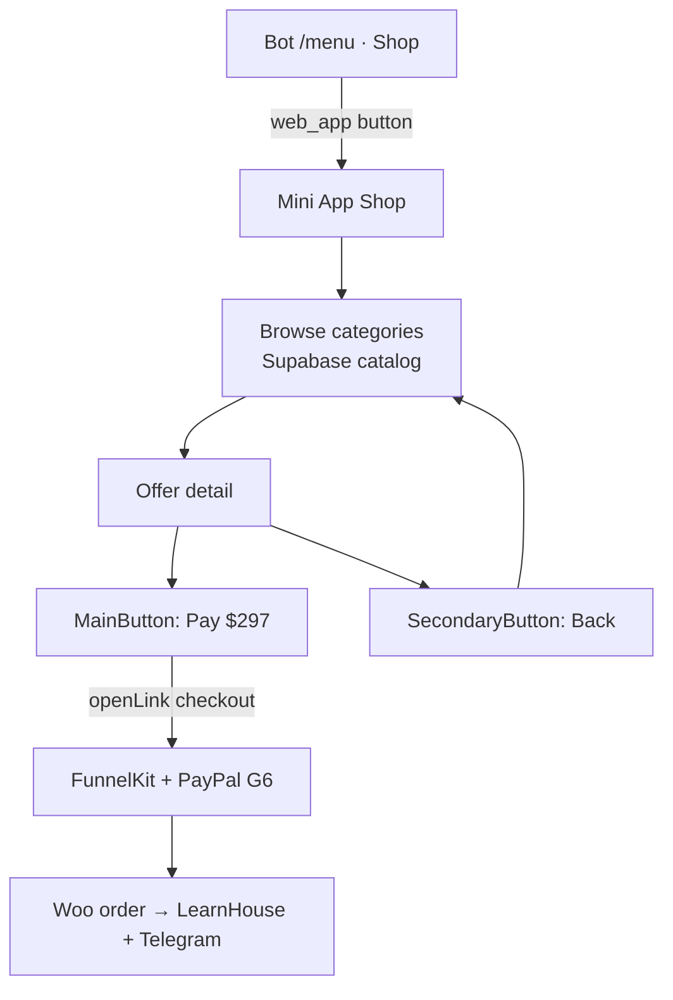

# Mini App — BottomButton (Alpha Elite adapt)

> **Nguồn gốc:** [Telegram Mini Apps — BottomButton](https://core.telegram.org/bots/webapps#bottombutton)  
> **Áp dụng:** Shop Alpha Elite trong Telegram — thay/bổ sung inline URL buttons bằng Mini App native.

---

## Tóm tắt

`BottomButton` là API native của Telegram Mini App để điều khiển **nút cố định dưới cùng** màn hình (thanh bottom bar). Có hai instance:

| Object | `type` | Mặc định | Vai trò Alpha Elite |
|--------|--------|----------|---------------------|
| `Telegram.WebApp.MainButton` | `main` | Text: `Continue` | **Mua / Thanh toán** — mở FunnelKit checkout |
| `Telegram.WebApp.SecondaryButton` | `secondary` | Text: `Cancel` | **Quay lại / Đóng** — về danh mục hoặc đóng Mini App |

> Bot API 7.10+ đổi tên class `MainButton` → `BottomButton`; alias `MainButton` vẫn dùng được.

---

## Vì sao dùng cho Alpha Elite?

Hiện tại bot dùng **inline keyboard + URL** (`menus.py` → Woo checkout). Mini App + BottomButton cho UX tốt hơn:

| Inline URL (hiện tại) | Mini App + BottomButton |
|-----------------------|-------------------------|
| Rời Telegram → browser | Ở trong app, full-screen catalog |
| Không loading state | `showProgress()` khi chờ Woo/sync |
| Nhiều nút rời rạc | 1 CTA chính + 1 phụ cố định |
| Khó stream / rich UI | HTML catalog từ Supabase (Model B) |

**PayPal vẫn ở FunnelKit** — BottomButton chỉ mở checkout URL (`hoa-homes.com`), không thay G6 PayPal.

---

## Luồng đề xuất



```text
Woo (giá/SKU) → sync → Supabase → Mini App render → BottomButton → FunnelKit checkout
```

---

## API BottomButton — tham chiếu nhanh

### Thuộc tính đọc

| Field | Mô tả |
|-------|--------|
| `type` | `main` hoặc `secondary` |
| `text` | Nhãn nút |
| `color` / `textColor` | Màu nút / chữ (theo `themeParams`) |
| `isVisible` | Đang hiện hay ẩn (mặc định `false`) |
| `isActive` | Enabled / disabled |
| `hasShineEffect` | Hiệu ứng shine (Bot API 7.10+) |
| `position` | Vị trí secondary: `left` \| `right` \| `top` \| `bottom` |
| `iconCustomEmojiId` | Emoji custom trước text (Bot API 9.5+) |
| `isProgressVisible` | Đang hiện spinner loading |

### Methods (chainable)

| Method | Dùng khi |
|--------|----------|
| `setText(text)` | Đổi nhãn — vd. `Pay $297` |
| `setParams({...})` | Batch: text, color, position, `is_active`, `is_visible`, `has_shine_effect`, `icon_custom_emoji_id` |
| `show()` / `hide()` | Hiện / ẩn nút |
| `enable()` / `disable()` | Cho phép / chặn bấm |
| `showProgress(leaveActive?)` | Spinner — gọi trước `openLink` nếu checkout chậm |
| `hideProgress()` | Tắt spinner |
| `onClick(cb)` / `offClick(cb)` | Handler — alias `mainButtonClicked` / `secondaryButtonClicked` |

### Events

| Event | Khi nào |
|-------|---------|
| `mainButtonClicked` | User bấm MainButton |
| `secondaryButtonClicked` | User bấm SecondaryButton (Bot API 7.10+) |

**Lưu ý:** Mở Mini App từ attachment menu → MainButton **ẩn** cho đến khi user tương tác UI lần đầu.

---

## Pattern Alpha Elite — Shop offer detail

```javascript
const tg = window.Telegram.WebApp;
tg.ready();
tg.expand();

const offer = { sku: 'AE-APP-001', name: 'Apprentice', price: 297, checkoutUrl: 'https://hoa-homes.com/checkout/?add-to-cart=...' };

// Secondary: quay lại danh mục
tg.SecondaryButton
  .setText('« Danh mục')
  .onClick(() => { window.location.hash = '#shop'; })
  .show();

// Main: thanh toán → FunnelKit (external)
tg.MainButton
  .setText(`Pay $${offer.price}`)
  .onClick(() => {
    tg.MainButton.showProgress(false);
  tg.HapticFeedback.impactOccurred('medium');
    tg.openLink(offer.checkoutUrl, { try_instant_view: false });
    tg.MainButton.hideProgress();
  })
  .show();
```

### Catalog list — ẩn MainButton

Ở màn danh mục chỉ browse — không có CTA mua:

```javascript
tg.MainButton.hide();
tg.SecondaryButton.hide();
```

### Gameplan free (AE-GP-000)

```javascript
tg.MainButton
  .setText('Get Free Gameplan')
  .onClick(() => tg.openLink('https://hoa-homes.com/gameplan'))
  .show();
```

### VIP — form @username trước checkout

```javascript
tg.MainButton.setText('Continue to VIP').onClick(() => {
  if (!document.getElementById('tg_username').value.trim()) {
    tg.showAlert('Nhập @telegram username');
    return;
  }
  tg.MainButton.showProgress();
  tg.openLink(vipCheckoutUrl);
  tg.MainButton.hideProgress();
}).show();
```

---

## Bot mở Mini App

### Inline keyboard (shop thay callback)

```python
from telegram import InlineKeyboardButton, InlineKeyboardMarkup, WebAppInfo

SHOP_WEBAPP_URL = "https://learn.hoa-homes.com/miniapp/shop"  # HTTPS bắt buộc

def shop_webapp_keyboard() -> InlineKeyboardMarkup:
    return InlineKeyboardMarkup([[
        InlineKeyboardButton(
            "🛒 Mở Shop",
            web_app=WebAppInfo(url=SHOP_WEBAPP_URL),
        )
    ]])
```

### Menu button / @BotFather

`@BotFather` → Bot Settings → **Configure Mini App** → URL shop.

### `sendData` (tùy chọn)

Chỉ khi mở qua **KeyboardButton** `web_app` (không phải inline). Mini App gọi `Telegram.WebApp.sendData(JSON)` → bot nhận `message.web_app_data` — dùng cho “đã chọn SKU” mà không cần server riêng. Shop Alpha Elite **ưu tiên `openLink` checkout** thay vì `sendData`.

---

## Map SKU → BottomButton (Model B)

| SKU | MainButton | SecondaryButton | Action |
|-----|------------|-----------------|--------|
| AE-GP-000 | Get Free Gameplan | Back | `openLink` gameplan URL |
| AE-APP-001 | Pay $297 | « Danh mục | `openLink` FunnelKit |
| AE-VIP-MON | Pay $149/mo | Back | + form @username |
| AE-VIP-YR | Pay $1290/yr | Back | + form @username |
| AE-DWY-001 | Request call | Back | `sendData` hoặc support flow |
| AE-QNT-001 | Apply | Back | `openLink` apply page |

Giá lấy từ Supabase (`offers.price_usd`) sau `sync-woo-catalog.py` — không hardcode trong Mini App.

---

## Checklist triển khai (P1)

1. Host Mini App HTTPS (cùng domain LearnHouse hoặc subdomain).
2. `@BotFather` → Configure Mini App + optional Threaded Mode (AI support sau).
3. Load `telegram-web-app.js` + validate `initData` server-side nếu có API riêng.
4. Fetch catalog từ Supabase REST (public read) hoặc proxy qua bot backend.
5. MainButton / SecondaryButton theo bảng SKU trên.
6. Giữ bot inline shop làm **fallback** khi Mini App chưa deploy.

---

## Liên quan

| Doc | Nội dung |
|-----|----------|
| [shop-catalog.md](shop-catalog.md) | Model B Woo → Supabase → bot |
| [kickstart/02-stack-architecture.md](kickstart/02-stack-architecture.md) | Mini App P1 trong stack |
| [alpha-elite-ux-flow-hermes-p2.md](../../knowledge/plans/alpha-elite-ux-flow-hermes-p2.md) | Funnel PayPal G6 — không đổi |

---

*Adapted from Telegram Mini Apps docs · 2026-07-06*
